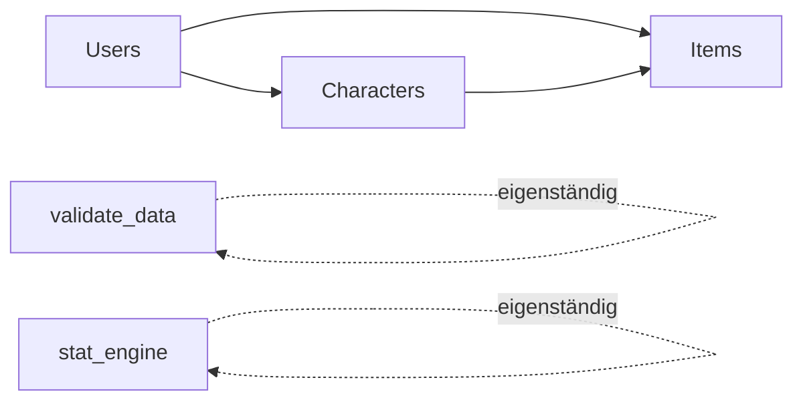

# API-Referenz `dnd_stats_app`

Diese Datei fasst alle Funktionen zusammen, die von außen (z. B. von einer künftigen
Web-App, einem CLI-Tool oder anderen Modulen) aufgerufen werden sollen. Ziel ist,
dass diese Referenz zum Verwenden der Funktionen ausreicht, ohne den Quellcode lesen
zu müssen.

Nicht dokumentiert sind private Hilfsfunktionen (Namen mit `_`-Präfix) und die
`main()`-Funktionen der Module (das sind Selbsttests/Demos, keine öffentliche API).

Der Ordner `ForeLaterUse/` wurde bei dieser Zusammenfassung ignoriert.

---

## Users.py — Benutzerverwaltung

Verwaltet `data/Users.json` und die zugehörigen Benutzerordner unter `data/User/`.
Benutzerverwaltungs-Operationen erfordern das globale Admin-Passwort (`Users.AdminPassword`, aktuell `"1234"`).
Es gibt ausschließlich die Rollen `gm` und `player`; `gm` besitzt alle Managerrechte.
`Users.json` enthält außerdem `next_id`, den persistenten Zähler für die nächste User-ID.

### `createUser(adminpass: str, username: str, password_Hash: str, role: str) -> str`
Legt einen neuen Benutzer an und erstellt seinen Ordner unter `data/User/<id ohne "User_">`.
- **Parameter:**
  - `adminpass` — muss `AdminPassword` entsprechen.
  - `username` — Anzeigename des Benutzers.
  - `password_Hash` — Passwort-Hash (wird 1:1 gespeichert, kein Hashing durch die Funktion).
  - `role` — `"gm"` oder `"player"`.
- **Rückgabe:** neue Benutzer-ID im Format `"User_<n>"`.
- **Fehler:** `ValueError`, wenn `adminpass` falsch ist oder die Rolle ungültig ist.

### `hasUser(userId: str) -> bool`
Prüft, ob eine Benutzer-ID in `Users.json` existiert.
- **Rückgabe:** `True`/`False`.

### `listUsers(adminpass: str) -> list[str]`
Listet alle Benutzer-IDs.
- **Fehler:** `ValueError` bei falschem `adminpass`.

### `getUserRole(userId: str) -> str | None`
Liefert die Rolle (`"gm"` oder `"player"`) eines Benutzers oder `None`, wenn er nicht existiert.

### `loginTestUser(userId: str, username: str, password_Hash: str) -> bool`
Prüft Zugangsdaten (Benutzer-ID + Username + Passwort-Hash müssen übereinstimmen).
- **Rückgabe:** `True` bei Erfolg, sonst `False`. Wirft keine Exception bei falschen Daten.

### `deleteUser(adminpass: str, userId: str) -> None`
Entfernt den Benutzer aus `Users.json` und löscht seinen kompletten Ordner samt Inhalt.
- **Fehler:** `ValueError` bei falschem `adminpass`. Kein Fehler, wenn `userId` nicht existiert (No-Op).

---

## Characters.py — Charakterverwaltung

Verwaltet Charaktere unter `data/User/<benutzerordner>/<charakterordner>/`. Jede Funktion
prüft Login-Daten selbst (`user_id`, `username`, `password_hash`) über `Users.loginTestUser`.
Die Rolle `gm` gilt als Managerrolle mit erweiterten Rechten.

### `createCharacter(user_id, username, password_hash, folder_name, display_name) -> str`
Legt einen neuen Charakter im **eigenen** Benutzerordner an (jeder validierte Benutzer darf das).
Erstellt `Character.json`, `Inventory.json`, `StatSheet.json` (aus den Templates in `data/`) sowie
einen `documents`-Unterordner.
- **Parameter:**
  - `folder_name` — Ordnername des Charakters (muss im Benutzerordner eindeutig sein).
  - `display_name` — Anzeigename, nicht-leerer String.
- **Rückgabe:** neue Charakter-ID, Format `"Charakter_<folder_name>"`.
- **Fehler:** `PermissionError` bei ungültigem Login; `ValueError` bei fehlendem Benutzerordner,
  bereits existierendem Charakterordner oder leerem `display_name`.

### `deleteCharacter(user_id, username, password_hash, character_id) -> None`
Löscht einen Charakterordner komplett.
- **Rechte:** Eigentümer des Charakters ODER GM.
- **Fehler:** `PermissionError` bei fehlenden Rechten/ungültigem Login; `ValueError`, wenn
  `character_id` nicht existiert.

### `listOwnCharacters(user_id, username, password_hash) -> list[str]`
Listet alle Charakter-IDs im eigenen Benutzerordner des Aufrufers.

### `listUserCharacters(user_id, username, password_hash, target_user_id) -> list[str]`
Listet Charakter-IDs eines anderen Benutzers.
- **Rechte:** nur wenn `target_user_id == user_id`, oder Aufrufer ist GM.
- **Fehler:** `PermissionError`; `ValueError`, wenn `target_user_id` nicht existiert.

### `listAllCharacters(user_id, username, password_hash) -> list[str]`
Listet alle Charakter-IDs aller Benutzer.
- **Rechte:** nur GM. Sonst `PermissionError`.

### `getKnownCharacters(user_id, username, password_hash, character_id) -> list[str]`
Liest die Liste `known_Charakters` eines Charakters.
- **Rechte:** Eigentümer des Charakters ODER GM.
- **Fehler:** `PermissionError` bei fehlenden Rechten/ungültigem Login; `ValueError`, wenn
  `character_id` nicht existiert.

### `getKnownSkills(user_id, username, password_hash, character_id) -> list[str]`
Liest die Liste `known_Skills` eines Charakters.
- **Rechte:** Eigentümer des Charakters ODER GM.
- **Fehler:** wie bei `getKnownCharacters`.

### `getKnownSpellEffects(user_id, username, password_hash, character_id) -> list[str]`
Liest die Liste `known_SpellEffects` eines Charakters.
- **Rechte:** Eigentümer des Charakters ODER GM.
- **Fehler:** wie bei `getKnownCharacters`.

### `getKnownStatusEffects(user_id, username, password_hash, character_id) -> list[str]`
Liest die Liste `known_StatusEffects` eines Charakters.
- **Rechte:** Eigentümer des Charakters ODER GM.
- **Fehler:** wie bei `getKnownCharacters`.

### `editKnownCharacters(user_id, username, password_hash, character_id, known_characters: list[str]) -> None`
Ersetzt die Liste `known_Charakters` eines Charakters (Referenzen auf andere existierende Charaktere).
- **Rechte:** nur GM.
- **Fehler:** `PermissionError`; `ValueError` bei ungültiger Liste oder unbekannter Charakter-ID
  in `known_characters`.

### `editKnownSkills(user_id, username, password_hash, character_id, known_skills: list[str]) -> None`
Ersetzt `known_Skills`. Jede ID muss mit `"Skill_"` beginnen und in `data/Global/Skills.json` existieren.
- **Rechte:** nur GM.

### `editKnownSpellEffects(user_id, username, password_hash, character_id, known_spell_effects: list[str]) -> None`
Ersetzt `known_SpellEffects`. IDs müssen mit `"SpellEffect_"` beginnen und in
`data/Global/SpellEffects.json` existieren.
- **Rechte:** nur GM.

### `editKnownStatusEffects(user_id, username, password_hash, character_id, known_status_effects: list[str]) -> None`
Ersetzt `known_StatusEffects`. IDs müssen mit `"StatusEffekt_"` beginnen und in
`data/Global/StatusEffekts.json` existieren.
- **Rechte:** nur GM.

---

## Items.py — Gegenstandsverwaltung

Verwaltet globale Items in `data/Global/Items.json` und ihre Zuweisung zu Charakter-Inventaren
(`Inventory.json`) sowie Ausrüstung im `StatSheet.json` (`equipped_items.rows`).

### `createItem(user_id, username, password_hash, name, description, stat_bonus=None) -> str`
Erstellt ein neues, noch niemandem zugewiesenes Item.
- **Parameter:**
  - `name` — nicht-leerer String.
  - `description` — String (darf leer sein).
  - `stat_bonus` — optionales Dict mit genau den Feldern `Mut, Klugheit, Intuition, Charisma,
    Fingerfertigkeit, Gewandheit, Konstitution, Körperkraft, MagieSpeicher, MagieRegeneration`,
    jeweils ganzzahlig zwischen -10 und 10. Fehlt es, werden alle Werte auf 0 gesetzt.
- **Rechte:** nur GM.
- **Rückgabe:** neue Item-ID, Format `"Item_<n>"`.
- **Fehler:** `PermissionError`; `ValueError` bei ungültigem Namen/Beschreibung/`stat_bonus`.

### `deleteItem(user_id, username, password_hash, item_id) -> None`
Löscht ein Item dauerhaft. Nur möglich, wenn das Item **keinem** Charakter zugewiesen ist.
- **Rechte:** nur GM.
- **Fehler:** `PermissionError`; `ValueError`, wenn Item nicht existiert oder noch zugewiesen ist.

### `assignItemToCharacter(user_id, username, password_hash, item_id, character_id) -> None`
Weist ein noch nicht zugewiesenes Item einem Charakter-Inventar zu.
- **Rechte:** nur GM.
- **Fehler:** `PermissionError`; `ValueError`, wenn Item bereits zugewiesen ist, Charakter nicht
  existiert oder Item schon im Inventar liegt.

### `equipItem(user_id, username, password_hash, item_id, character_id) -> None`
Markiert ein zugewiesenes Item als ausgerüstet und trägt es in `StatSheet.json` unter
`equipped_items.rows` ein (idempotent — mehrfacher Aufruf ist unschädlich).
- **Rechte:** Charaktereigentümer ODER GM.
- **Fehler:** `PermissionError`; `ValueError`, wenn Item nicht diesem Charakter gehört oder nicht
  im Inventar liegt.

### `unequipItem(user_id, username, password_hash, item_id, character_id) -> None`
Entfernt ein Item aus `equipped_items.rows` und setzt das Flag `equipped` zurück.
- **Rechte:** Charaktereigentümer ODER GM.
- **Fehler:** `PermissionError`; `ValueError`, wenn Item nicht diesem Charakter gehört.

### `removeItemFromCharacter(user_id, username, password_hash, item_id, character_id) -> None`
Entfernt ein **nicht ausgerüstetes** Item aus dem Inventar eines Charakters (Item wird wieder
"herrenlos", nicht gelöscht).
- **Rechte:** nur GM.
- **Fehler:** `PermissionError`; `ValueError`, wenn Item nicht diesem Charakter gehört, noch
  ausgerüstet ist, oder nicht im Inventar liegt.

### `moveItemBetweenCharacters(user_id, username, password_hash, item_id, from_character_id, to_character_id) -> None`
Verschiebt ein nicht ausgerüstetes Item von einem Charakter zu einem anderen — nur wenn der
Quell-Charakter den Ziel-Charakter in seiner `known_Charakters`-Liste kennt.
- **Rechte:** Eigentümer des Quell-Charakters ODER GM.
- **Fehler:** `ValueError` (gleiche Quelle/Ziel, Item nicht zugewiesen/ausgerüstet, Item fehlt im
  Quell-Inventar, Item bereits im Ziel-Inventar); `PermissionError` (Quelle kennt Ziel nicht /
  ungültiger Login / keine Berechtigung).

---

## Skills.py — Globale Skills

Skills werden ohne Nutzerbezug in `data/Global/Skills.json` gespeichert. Eine aktive
Zuweisung wird als `{"ID": "Skill_..."}` in `StatSheet.json` unter
`learned_abilities.rows` gespeichert.

### `createSkill(user_id, username, password_hash, name, beschreibung, stat_bonus=None, talent_bonus=None, skill_bonus=None, alters_anstieg=0) -> str`
Erstellt einen globalen Skill mit einer ID im Format `Skill_<n>`. Die drei Bonus-Dictionaries
entsprechen dem bestehenden Schema und werden bei Auslassung mit Nullwerten gefüllt. Jeder
Bonus liegt zwischen -10 und 10. Nur GM.

### `deleteSkill(user_id, username, password_hash, skill_id) -> None`
Löscht einen Skill, sofern er weder aktiv ist noch in einer `known_Skills`-Liste referenziert wird. Nur GM.

### `assignSkillToCharacter(user_id, username, password_hash, skill_id, character_id) -> None`
Aktiviert einen Skill. GM darf jeden Charakter bearbeiten; Spieler dürfen nur eigene
Charaktere bearbeiten und nur IDs aus `known_Skills` verwenden.

### `removeSkillFromCharacter(user_id, username, password_hash, skill_id, character_id) -> None`
Entfernt die aktive Skill-Zeile. Es gelten dieselben Rechte wie beim Hinzufügen.

## SpellEffects.py — Globale Zaubereffekte

SpellEffects werden ohne Nutzerbezug in `data/Global/SpellEffects.json` gespeichert. Aktive
Einträge liegen in `StatSheet.json` unter `active_spell_effects.rows`.

### `createSpellEffect(user_id, username, password_hash, name, description, default_duration=0, default_time_to_death=0, stat_bonus=None, talent_bonus=None, skill_bonus=None) -> str`
Erstellt einen globalen SpellEffect mit einer ID im Format `SpellEffect_<n>`. Das bestehende
Schema wird beibehalten; Dauer und Zeit bis zum Tod sind nicht-negative Ganzzahlen und Bonuswerte
liegen zwischen -10 und 10. Nur GM.

### `deleteSpellEffect(user_id, username, password_hash, spell_effect_id) -> None`
Löscht einen nicht aktiven SpellEffect, der auch nicht in `known_SpellEffects` referenziert wird. Nur GM.

### `assignSpellEffectToCharacter(user_id, username, password_hash, spell_effect_id, character_id) -> None`
Aktiviert einen SpellEffect. Spieler dürfen nur eigene Charaktere und IDs aus `known_SpellEffects`
verwenden; GM darf jeden Charakter bearbeiten.

### `removeSpellEffectFromCharacter(user_id, username, password_hash, spell_effect_id, character_id) -> None`
Entfernt einen aktiven SpellEffect. Es gelten dieselben Rechte wie beim Hinzufügen.

## Statuseffekts.py — Globale Statuseffekte

StatusEffects werden ohne Nutzerbezug in `data/Global/StatusEffekts.json` gespeichert. Aktive
Einträge liegen in `StatSheet.json` unter `active_status_effects.rows`.

### `createStatusEffect(user_id, username, password_hash, name, beschreibung, default_duration=0, default_time_to_death=0, stat_bonus=None, talent_bonus=None) -> str`
Erstellt einen globalen StatusEffekt mit einer ID im Format `StatusEffekt_<n>`. Das bestehende
Schema wird beibehalten; Dauer und Zeit bis zum Tod sind nicht-negative Ganzzahlen und Bonuswerte
liegen zwischen -10 und 10. Nur GM.

### `deleteStatusEffect(user_id, username, password_hash, status_effect_id) -> None`
Löscht einen nicht aktiven StatusEffekt, der auch nicht in `known_StatusEffects` referenziert wird. Nur GM.

### `assignStatusEffectToCharacter(user_id, username, password_hash, status_effect_id, character_id) -> None`
Aktiviert einen StatusEffekt. Spieler dürfen nur eigene Charaktere und IDs aus `known_StatusEffects`
verwenden; GM darf jeden Charakter bearbeiten.

### `removeStatusEffectFromCharacter(user_id, username, password_hash, status_effect_id, character_id) -> None`
Entfernt einen aktiven StatusEffekt. Es gelten dieselben Rechte wie beim Hinzufügen.

## stat_engine.py — Formel-Engine für StatSheet.json

Wertet die Formel-Felder (`{"formula": "...", "value": ...}`) einer `StatSheet.json` aus.
Unterstützte Operatoren: `+ - * /`, Klammern, sowie Funktionen `MIN, MAX, ABS, MEDIAN, SUM`.
Pfade können mit `[]` auf Listen-Zeilen verweisen (z. B. `equipped_items.rows[].stat_bonus.Mut`),
was intern über `AggregateList` aggregiert wird.

### `load_and_compute(path: str | Path) -> dict`
Lädt eine `StatSheet.json`-Datei, berechnet **alle** Formel-Felder und gibt das aktualisierte
Dokument (als Dict) zurück. Schreibt die Datei **nicht** automatisch zurück auf die Platte —
das muss der Aufrufer selbst tun (siehe `validate_data.main()`/`stat_engine.main()` als Beispiel).
- **Fehler:** `FormulaError` (inkl. Unterklasse `CircularReferenceError`) bei fehlerhaften Formeln
  oder zirkulären Referenzen; `CouldNotReach`, wenn ein referenzierter Pfad (z. B. auf ein Item,
  einen Skill, einen Spell-/StatusEffekt) nicht auflösbar ist.

### Klasse `StatSheetEngine(doc: dict)`
Für Fälle, in denen man mehr Kontrolle braucht als `load_and_compute` bietet (z. B. gezieltes
Nachschlagen einzelner Felder statt des gesamten Dokuments).
- `engine.get(path: str)` — löst einen einzelnen Punkt-Pfad auf (z. B. `"stats.Mut.wert"`) und
  gibt den berechneten Wert zurück. Formel-Ergebnisse werden gecached.
- `engine.compute_all() -> dict` — berechnet alle Formel-Felder unter `meta`, `stats`, `talents`,
  `skills` und gibt `engine.doc` zurück (identisch zum Verhalten von `load_and_compute`).
- Wirft dieselben Fehler wie oben (`FormulaError`, `CircularReferenceError`, `CouldNotReach`).

### Fehlerklassen (zum Abfangen)
- `FormulaError` — Basisklasse für Formel-/Parserfehler.
- `CircularReferenceError(FormulaError)` — ein Feld hängt (direkt/indirekt) von sich selbst ab.
- `CouldNotReach` — ein referenzierter Objektpfad existiert nicht oder ist kein Zahlenwert.

---

## validate_data.py — Datenintegritätsprüfung

Prüft die gesamte Datenstruktur unter `dnd_stats_app/data/` auf Konsistenz. Alle Funktionen
werfen bei einem Problem eine Exception (`FileNotFoundError` oder `ValueError`) mit einer
sprechenden Fehlermeldung; geben bei Erfolg nichts zurück (`None`).

### `TestUsers(executable_path: Path) -> None`
Prüft `Users.json`: jede ID beginnt mit `"User_"`, hat `username`, `password_hash` und eine
gültige `role` (`"gm"` oder `"player"`).

### `TestForStatSheetTemplate(executable_path: Path) -> None`
Prüft, dass `stat_sheet_template.json` existiert und gültiges JSON ist.

### `TestForGlobalDocuments(executable_path: Path) -> None`
Prüft, dass der `Global`-Ordner sowie `Items.json`, `Skills.json`, `SpellEffects.json`,
`StatusEffekts.json` existieren, gültiges JSON sind und ihre erwarteten Felder/Wertebereiche
(Stat-/Talent-/Skill-Boni jeweils zwischen -10 und 10) einhalten.

### `TestForUserFolder(executable_path: Path) -> None`
Prüft für jeden Benutzer aus `Users.json`, dass ein Ordner existiert, und für jeden
Charakterordner darin: vorhandene/valide `StatSheet.json`, `Inventory.json`, `Character.json`
und `documents`-Ordner, korrekte Verknüpfung von Item-Besitz/Ausrüstung zwischen `Inventory.json`,
`Items.json` und `StatSheet.json`, sowie dass alle `known_Charakters`-Referenzen tatsächlich
existierende Charaktere sind.

### `main() -> None`
Führt alle obigen Prüfungen in der Reihenfolge `TestUsers → TestForStatSheetTemplate →
TestForGlobalDocuments → TestForUserFolder` gegen `dnd_stats_app/data` aus. Nützlich als einziger
Einstiegspunkt, um "ist mein Datenordner konsistent?" zu beantworten — wirft bei jedem gefundenen
Problem sofort eine Exception ab.

---

## Modul-Abhängigkeiten (Aufrufreihenfolge beim Import)

`Characters.py` und `Items.py` importieren `Users.py` für Login-/Rollenprüfung.
`Items.py` importiert zusätzlich `Characters.py` (nur für dessen `main()`-Test) und `validate_data.py`.
`stat_engine.py` und `validate_data.py` sind unabhängig lauffähig.
